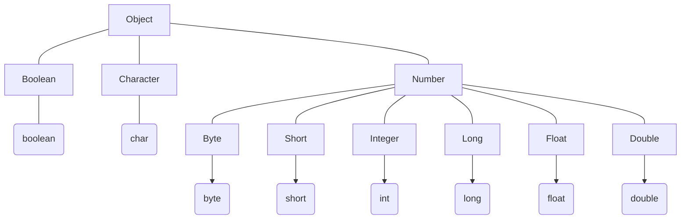
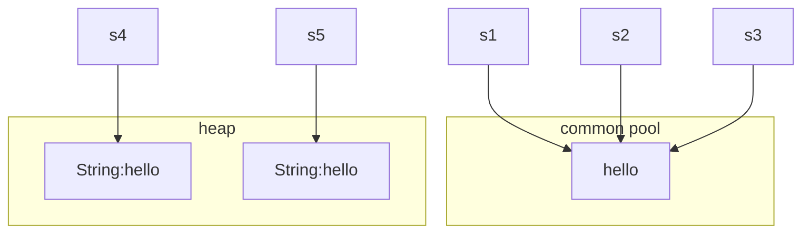

## 数据类型

### 基本数据类型 (Primitive types)
1. byte **8位**
    - `Byte.SIZE = 8`
    - `Byte.MIN_VALUE = -2 ^ 7 = -128`
    - `Byte.MAX_VALUE = 2 ^ 7 - 1 = 127` 

2. short **16位**
    - `Short.SIZE = 16`
    - `Short.MIN_VALUE = -2 ^ 15 = -32768`
    - `Short.MAX_VALUE = 2 ^ 15 - 1 = 32767`

3. int **32位**
    - `Int.SIZE = 32`
    - `Int.MIN_VALUE = -2 ^ 31 = -2147483648`
    - `Int.MAX_VALUE = 2 ^ 31 - 1 = 2147483647`

4. long **64位**
    - `Long.SIZE = 64`
    - `Long.MIN_VALUE = -2 ^ 63 = -9223372036854775808`
    - `Long.MAX_VALUE = 2 ^ 63 - 1 = 9223372036854775807`

5. float **单精度，32位**
    - `Float.SIZE = 32`
    - `Float.MIN_VALUE = 2 ^ -149 = 1.4E-45`
    - `Float.MAX_VALUE = 2 ^ 128 - 1 = 3.4028235E38` 
   
6. double **双精度，64位**， 浮点数的默认类型
    - `Double.SIZE = 64`
    - `Double.MIN_VALUE = 2 ^ -1074 = 4.9E-324`
    - `Double.MAX_VALUE = 2 ^ 1024 - 1 = 1.7976931348623157E308`

7. boolean
    - `true` or `false`, 默认值为`false`

8. char
    - 单一的**16位**Unicode字符

### 引用数据类型 (Reference types)
引用数据类型指向一个对象，指向对象的变量就是**引用变量**，该变量存储了对象在内存中的**地址**。引用变量在被声明时被指定为一个特殊的数据类型，如某一个特定的类。

### 常量
- 常量在程序运行时不能被修改
- 使用`final`关键字来修饰常量，声明方式如下：
    ```java
    final double PI = 3.1415926
    ```
- 通常使用**大写字母**表示常量

### 自动类型转换
整型、实型（常量）、字符型数据可以混合运算。不同的数据类型会转化为同一数据类型，转化优先级如下：
```java
byte, short, char -> int -> long -> float -> double
```
规则：
- 不能对`boolean`类型进行类型转换
- 容量大的类型转换为容量小的类型时必须使用[**强制类型转换**](#强制类型转换)
- 转换过程中可能导致溢出或损失精度
- 浮点数转换到整数时会**舍弃小数部分**，而不是四舍五入
- 字符转换为整数类型时的值为对应的**ASCII编号**

### 强制类型转换
规则：
- 转换的数据类型必须相互兼容
- 转换格式：`(type) value`

细节：
- 整数的默认类型是`int`
- 小数的默认类型是`double`，在定义`float`类型时须在数字后跟上`F`或`f`


## 变量类型
Java语言支持四种变量类型，分别为：**局部变量(Local Variables)**、**成员变量(Instance Variables)**、**静态变量(Class Variables)**、**参数变量(Parameters)**。

### 局部变量
- 作用范围：只在定义它们的代码块内部可见
- 生命周期：超出代码块该变量就会被销毁
- 作用: 用于存储代码块中临时的变量
- 例子：
    ```java
    public class variables {
        public static void cal_sum(){
            int x = 10;
            int y = 15;
            System.out.println("sum: " + (x + y));
        }

        public static void main(String[] args){
            for (int i = 0; i < 5; i++){
                System.out.print(i + " ");
            }
            // System.out.println(i);  i will not be stored after for loop
            // System.out.println(x);  x will not be stored out of the cal_sum block
            System.out.print("\n");
            cal_sum();
        }
    }
    ```
    1. 位于for循环中的循环变量`i`在离开循环代码块后就不再被保存，也无法被访问
    2. 位于静态方法`cal_sum`中的局部变量`x`在离开该方法的代码块后也无法被访问

### 成员变量
- 作用范围：类的**对象中**
- 生命周期：与类的**对象**的生命周期相同
- 作用：用于存储类的对象的特定状态与数据
- 例子：
    ```java
    public class variables {
        String instance_num = "instance variable";

        public static void main(String[] args){
            /* instance variable */
            // System.out.println(instance_num); instance_num can not be accessed without a object
            variables obj = new variables();
            System.out.println(obj.instance_num); 
        }
    }
    ```
    成员变量在对象实例被创造之前无法被访问，其完全依赖于对象的状态

### 静态变量
- 作用范围：类中
- 生命周期：与类的生命周期相同
- 作用：用于存储与整个类相关的信息，如常量或共享的状态
- 例子：
    ```java
    public class variables {
        static final double PI = 3.14;

        public static void main(String[] args){
            /* class variable */
            System.out.println(PI);
        }
    }
    ```
    其可以在类的静态方法中直接被访问

### 参数变量
- 作用范围：参数变量是方法的输入值，只在方法内部生效
- 生命周期：方法被执行期间
- 作用: 向方法传递数据
- 例子：
    ```java
    public class variables {
        public static void cal_sum_2(int p, int q){
            System.out.println("p + q = " + (p + q));
        }

        public static void main(String[] args){
            /* parameters */
            cal_sum_2(1, 2);
            // System.out.println(p); p can not be accessed out of the method
        }
    }
    ```
    对于方法`cal_sum_2`，`p`和`q`都是参数变量，只在执行这个方法期间存在，无法从外部被访问


## 修饰符
Java语言的修饰符分为两类：
- 访问修饰符
- 非访问修饰符

### 访问修饰符
用来保护对类、变量、方法和构造方法的访问。支持四种权限：
- **default**：什么也不写。
  - 可见范围：同一包内
  
- **private**
  - 可见范围：同一类内

- **public**
  - 可见范围：所有类

- **protected**
  - 可见范围：同一包内的类和所有子类

### 非访问修饰符
- **static**
  - 静态变量：**独立于类的对象的变量**。无论一个类实例化多少对象，静态变量都只有一份拷贝
  - 静态方法：**独立于对象的方法**，不能使用类的非静态变量

- **final**
  - final变量：一旦被赋值后就**不能被重新赋值**。通常用来和static一起用来创建类常量
  - final方法：父类中的final方法可以被子类继承，但**不能被子类重写**
  - final类：final类**不能被继承**


## 运算符
Java中的运算符主要可以分为以下几种：
- 算术运算符
- 关系运算符
- 位运算符
- 逻辑运算符
- 赋值运算符
- 其他运算符

### 算术运算符

|| 描述 |
|---|---|
| `+` | 加 |
| `-` | 减 |
| `*` | 乘 |
| `/` | 除 |
| `++` | 自增 |
| `--` | 自减 |

**注意**：自增和自减符号的顺序会影响结果。
- 前缀自增自减法（`++a`, `--a`）：
- 后缀自增自减法（`a++`, `a--`）

**区别**：前者先进行自增减运算，再进行表达式计算；后者先进行表达式计算，再进行自增减运算。示例：
```java
public class increment_decrement {
    public static void main(String[] args){
        int x = 20;
        System.out.println(++x);  // ++ first, then print x, 21
        System.out.println(x++);  // print x first, then ++, 21
        System.out.println(x);  // 22
    }
}
```

### 关系运算符

|| 描述 |
|---|---|
| `==` | 判断是否相等 |
| `!=` | 判断是否不等 |
| `>` | 判断是否左大于右 |
| `<` | 判断是否左小于右 |
| `>=` | 判断是否左大于等于右 |
| `<=` | 判断是否左小于等于右 |

### 位运算符

|| 描述 |
|---|---|
| `&` | 按位与 |
| `\|` | 按位或 |
| `^` | 按位异或 |
| `~` | 按位取反（一元运算符） |
| `<<` | 左移 |
| `>>` | 右移 |
| `>>>` | 右移，空位补零 |

### 逻辑运算符

|| 描述 |
|---|---|
| `&&` | and |
| `||` | or |
| `!` | not |

### 赋值运算符
与python基本一致，略

### 条件运算符
三元运算符，主要**决定哪个值应该赋值给变量**
```java
variable x = expression ? value1 : value2
// variable x = value1 if expression == True else value2
```


## 循环结构
### while
与python一致，例：
```java
public class loops {
    public static void main(String[] args){
        /* while loop */
        System.out.println("while loop:");
        int x = 5;
        while (x < 7){
            System.out.print(x + " ");
            x++;
        }
    }
}
```
输出：
```
while loop:
5 6 
```

### do ... while
**与while的区别**：最开始的时候若`while`后的布尔表达式结果为`false`，仍会执行一次`do`代码块中的内容。其余时候与普通的`while`没有区别。例：
```java
public class loops {
    public static void main(String[] args){
        /* do while loop */
        System.out.println("\ndo while loop:");
        int x = 10;
        do{
            System.out.print(x + " ");
            x++;
        } while (x < 7);
    }
}
```
输出:
```
do while loop:
10 
```

### for
与python一致，例：
```java
public class loops {
    public static void main(String[] args){
        /* for loop */
        System.out.println("\nfor loop:");
        int x = 5;
        for(; x < 7; x++){
            System.out.print(x + " ");
        }
    }
}
```
输出:
```
for loop:
5 6 
```

### for each（作用于数组）
Java5新特性，主要用于数组的循环。循环变量的类型与数组元素的类型匹配。例:
```java
public class loops {
    public static void main(String[] args){
        /* for each */
        System.out.println("\nfor each loop:");
        int [] nums = {1, 2, 3, 4 ,5};
        for (int num: nums){
            System.out.print(num + " ");
        }
        System.out.println();
        char [] alphabet = {'a', 'b', 'c'};
        for (char s: alphabet){
            System.out.print(s + " ");
        }
    }
}
```
输出：
```
for each loop:
1 2 3 4 5 
a b c 
```


## 条件语句

### if else
与python一致，注意语法即可。例：
```java
public class conditional_statement {
    public static void main(String[] args){
        boolean flag = false;
        if (!flag){
            System.out.println("yes!");
        } else {
            System.out.println("no!");
        }
    }
}
```
输出：
```
yes!
```

### if else if else
与python一致，注意语法即可。例：
```java
public class conditional_statement {
    public static void main(String[] args){
        int x = 0;
        for (; x < 20; x++){
            if (x % 4 == 0){
                System.out.print("a ");
            } else if (x % 4 == 1){
                System.out.print("b ");
            } else if (x % 4 == 2){
                System.out.print("c ");
            } else{
                System.out.print("d ");
            }
        }
    }
}
```
输出：
```
a b c d a b c d a b c d a b c d a b c d 
```

### switch case
用于判断**一个变量**与**一系列值**中的某个值是否相等，每个值称为一个分支。例：
```java
import java.util.Scanner;

public class conditional_statement {
    public static void main(String[] args){
        /* switch case */
        Scanner scanner = new Scanner(System.in);
        System.out.print("\nday = ");
        if (scanner.hasNextInt()){
            int day = scanner.nextInt();

            switch (day){
                case 1:
                    System.out.println("Monday");
                    break;
                case 2:
                    System.out.println("Tuesday");
                    break;
                case 3:
                    System.out.println("Wednesday");
                    break;
                case 4:
                    System.out.println("Thursday");
                    day += 1;
                    break;
                case 5:
                    System.out.println("Friday");
                    break;
                case 6:
                    System.out.println("Saturday");
                    break;
                case 7:
                    System.out.println("Sunday");
                    break;
                default:
                    System.out.println("Wrong input!");
            }
            System.out.println("\nday = " + day);
        }
        scanner.close();
    }
}
```
`day`输入为3时，输出：
```
day = 3
Wednesday

day = 3
```
`day`输入为4时，输出：
```
day = 4
Thursday

day = 5
```
由此可以发现，用于判断的那个值在进入`switch case`代码块后就已经确定了，虽然对应的变量的值仍然可以被修改，但是在和各个`case`比较的过程中用的还是**最初进入代码块时的值**。直到所有判断执行结束后，针对此变量值得修改才会生效。
<br>

此外，注意每个`case`中都存在`break`语句，用于终止后续不必要的判断。如果后续的一部分`case`中没有`break`，那么从满足条件的`case`到后续第一个存在`break`语句的`case`中的所有内容都会被执行，例：
```java
switch (day){
    case 1:
        System.out.println("Monday");
    case 2:
        System.out.println("Tuesday");
    case 3:
        System.out.println("Wednesday");
    case 4:
        System.out.println("Thursday");
        day += 1;
    case 5:
        System.out.println("Friday");
        break;
    case 6:
        System.out.println("Saturday");
        break;
    case 7:
        System.out.println("Sunday");
        break;
    default:
        System.out.println("Wrong input!");
}
```
输出：
```
day = 1
Monday
Tuesday
Wednesday
Thursday
Friday

day = 2
```


## 基础类
位于`java.lang`包中，无需特意使用`import`语句引用该包

### Number 类
不使用Java内置数据类型，而是调用包装好的`Number`类中的对象来获取数据对象。


**常用方法**：

| 方法 | 描述 |
|---|---|
| `xxxValue()` | 将`Number`对象转换为`xxx`数据类型的值并返回 |
| `valueOf()` | 返回一个`Number`对象指定的内置数据类型 |
| `toString()` | （将数字）以字符串形式返回值 |
| `parseInt()` | 将（数字的）字符串解析为`int`类型 |
| ... | ... |

一些例子：
```java
public class number{
    public static void main(String[] args){
        /* xxxvalue */
        Integer x = 5;
        Double y = 5.0;
        System.out.println("int x -> double x: " + x.doubleValue());
        System.out.println("double y -> int y: " + y.intValue());

        /* valueOf */
        Integer a = Integer.valueOf(9);
        System.out.println("a = " + a);

        /* toString */
        String x_string = x.toString();
        System.out.println(x_string.getClass());

        /* parseInt */
        String s = "68";
        int s_int = Integer.parseInt(s);
        System.out.println(s_int);
    }
}
```
输出：
```
int x -> double x: 5.0
double y -> int y: 5
a = 9
class java.lang.String
68
```

### Math 类
包含了用于执行基本数学运算的属性和方法。

**常用方法**：

| 方法 | 描述 |
|---|---|
| `abs()` | 绝对值 |
| `ceil()` | **向上**取整，返回类型为`double` |
| `floor()` | **向下**取整 |
| `round()` | 四舍五入，算法为`Math.floor(x + 0.5)` |
| `rint()` | 与参数最接近的整数，如果距离相同则取为**偶数**的那一个。返回类型为`double` |
| `max()` | **两个参数**中的最大值 |
| `min()` | **两个参数**中的最小值 |
| `exp()` | e的参数次幂 |
| `log()` | 参数的自然对数 |
| `pow()` | `pow(x, y)`，`x`的`y`次方 |
| `sqrt()` | 参数的算术平方根 |
| `random()` | 返回一个随机数 |
| ... | ... |

一些例子：
```java
public class math{
    public static void main(String[] args){
        /* ceil, floor, round, rint */
        double [] nums = {-2.5, -1.6, -1.5, -1.4, 1.4, 1.5, 1.6};
        for (double num: nums){
            double num_ceil = Math.ceil(num);
            double num_floor = Math.floor(num);
            double num_round = Math.round(num);
            double num_rint = Math.rint(num);
            
            System.out.print("num = " + num + " num_ceil = " + num_ceil);
            System.out.print(" num_floor = " + num_floor + " num_round = " + num_round);
            System.out.print(" num_rint = " + num_rint + "\n");
        }

        /* max, min */
        int a = 1, b = 2;
        System.out.println("\nmax: " + Math.max(a, b));
        System.out.println("min: " + Math.min(a, b));

        /* exp, log, pow, sqrt */
        System.out.println("\ne ^ log2 = " + Math.exp(Math.log(2)));
        System.out.println("log(e ^ 3) = " + Math.log(Math.pow(Math.E, 3)));
        System.out.println("sqrt(16) = " + Math.sqrt(16));

        /* random */
        System.out.println("\nrandom number: " + Math.random());
    }
}
```
输出:

|  | ceil | floor | round | rint |
|---|---|---|---|---|
| <span style="color: orange">-2.5</span> | -2.0 | -3.0 | <span style="color: red">-2.0</span> | <span style="color: red">-2.0</span> |
| <span style="color: orange">-1.6</span> | -1.0 | -2.0 | -2.0 | -2.0 |
| <span style="color: orange">-1.5</span> | -1.0 | -2.0 | <span style="color: red">-1.0</span> | <span style="color: red">-2.0</span> | 
| <span style="color: orange">-1.4</span> | -1.0 | -2.0 | -1.0 | -1.0 |
| <span style="color: orange">1.4</span> | 2.0 | 1.0 | 1.0 | 1.0 |
| <span style="color: orange">1.5</span> | 2.0 | 1.0 | 2.0 | 2.0 |
| <span style="color: orange">1.6</span> | 2.0 | 1.0 | 2.0 | 2.0 |

```
max: 2
min: 1

e ^ log2 = 2.0
log(e ^ 3) = 3.0
sqrt(16) = 4.0

random number: 0.3463097398410294
```

### Character 类
用于对单个字符进行操作。对象为一个基本数据类型为`char`的值。

**常用方法**

| 方法 | 描述 |
|---|---|
| `isLetter()` | 判断字符是否为**字母** |
| `isDigit()` | 判断字符是否为**数字** |
| `isWhitespace()` | 判断字符是否为**空格**字符（注意：**空字符**在Java中用`'\0'`表示） |
| `isUpperCase()` | 判断字符是否为**大写字母** |
| `isLowerCase()` | 判断字符是否为**小写字母** |
| `toUpperCase()` | 将字符**转变为大写字母** |
| `toLowerCase()` | 将字符**转变为小写字母** |
| `toString()` | 返回字符的**字符串形式**，长度为1 |
| ... | ... |

一些例子：
```java
public class character{
    public static void main(String[] args){
        Character [] chars = {'A', 'a', '1', ' '};
        for (Character c: chars){
            character.print_res(c);
        }
    }

    private static void print_res(Character c){
        System.out.print("\n\n" + c + "\tis letter: " + Character.isLetter(c));
        System.out.print("\tis digit: " + Character.isDigit(c));
        System.out.print("\tis white space: " + Character.isWhitespace(c));
        System.out.print("\tis uppercase: " + Character.isUpperCase(c));
        System.out.print("\tis lowercase: " + Character.isLowerCase(c));
        System.out.print("\tto uppercase: " + Character.toUpperCase(c));
        System.out.print("\tto lowercase: " + Character.toLowerCase(c));
        System.out.print("\tto string: " + Character.toString(c).getClass());
    }
}
```
输出：
```
A	is letter: true	    is digit: false	is white space: false	is uppercase: true	    is lowercase: false	    to uppercase: A	    to lowercase: a	    to string: class java.lang.String

a	is letter: true	    is digit: false	is white space: false	is uppercase: false	    is lowercase: true	    to uppercase: A	    to lowercase: a	    to string: class java.lang.String

1	is letter: false	is digit: true	is white space: false	is uppercase: false	    is lowercase: false	    to uppercase: 1	    to lowercase: 1	    to string: class java.lang.String

 	is letter: false	is digit: false	is white space: true	is uppercase: false	    is lowercase: false	    to uppercase:  	    to lowercase:  	    to string: class java.lang.String
```

### String 类
用来创建和操作字符串对象，但是**不能直接对该对象进行修改**。创建字符串的方法有两种：
- 直接创建
    ```java
    String s1 = "hello";
    ```
- 使用对象创建
    ```java
    String s1 = new String("hello");
    ```

区别：使用前者创建的字符串存储在**公共池**中，当想要创建的字符串已经存在于公共池中时便不会再额外创建新的字符串对象了，而是直接**引用**已存在的字符串对象。而使用后者创建的字符串存储在**堆**上，此时无论是否已存在相同的字符串都会在堆内存上分配一个新的对象。示例代码如下：
```java
String s1 = "hello";
String s2 = "hello";
String s3 = s1;
String s4 = new String("hello");
String s5 = new String("hello");
```
创建情况示意图如下：


此外，字符串还可以通过字符数组创建：
```java
char [] chars = {'h', 'e', 'l', 'l', 'o'};
String s6 = new String(chars);
```

<br>

**常用方法**

| 方法 | 描述 |
|---|---|
| `charAt(int index)` | 返回指定索引处的字符 |
| `concat(String str)` | 将参数中的字符串连接到此字符串之后 |
| `equals(Object obj)` | 判断此字符串与指定对象是否相等 |
| `indexOf(String str)` | 返回指定字符**第一次**在字符串中出现处的索引，若不存在返回`-1` |
| `length()` | 返回字符串长度 |
| `replace(char old, char new)` | **返回一个新的字符串**，将原字符串中所有指定字符换成新的指定字符 |
| `substring(int begin, int end)` | **返回一个新的字符串**，是指定索引范围的子串，**左闭右开** |
| `toCharArray()` | 将此字符串转换为一个新的字符数组 |
| `contains(CharSequence chars)`* | 判断是否包含指定的字符序列 |
| `isEmpty()` | 判断字符串是否为空 |
| ... | ... |

注*：`CharSequence`是一个接口，`String`继承自`CharSequence`，也就是说`String`也是`CharSequence`类型。`contains()`方法中传入字符串类型即可。

<br>

**代码示例**：
```java
import java.util.Arrays;

public class string {
    public static void main(String[] args){
        /* create strings */
        String s1 = "hello";
        String s2 = new String("hello");
        
        char [] chars = {'h', 'e', 'l', 'l', 'o'};
        String s3 = new String(chars);

        System.out.println("s1: " + s1);
        System.out.println("s2: " + s2);
        System.out.println("s3: " + s3);

        /* methods */
        System.out.println("\ncharAt: " + s1.charAt(0));
        System.out.println("concat: " + s1.concat(s2));
        System.out.println("equals: " + s1.equals(s3));
        System.out.println("indexOf: " + s1.indexOf("l"));
        System.out.println("lastIndexOf: " + s1.lastIndexOf("l"));
        System.out.println("length: " + s1.length());
        System.out.println("replace: " + s1.replace('l', 'x'));
        System.out.println("substring: " + s1.substring(1, 3));
        char [] s1_array = s1.toCharArray();
        System.out.println(Arrays.toString(s1_array));
        System.out.println("contains: " + s1.contains("l"));
        System.out.println("isEmpty: " + s1.isEmpty());
    }
}
```
输出：
```
s1: hello
s2: hello
s3: hello

charAt: h
concat: hellohello
equals: true
indexOf: 2
lastIndexOf: 3
length: 5
replace: hexxo
substring: el
[h, e, l, l, o]
contains: true
isEmpty: false
```

### StringBuffer 和 StringBuilder 类
对字符串本身进行修改时用到这两个类，修改后不会产生新的未使用对象。`StringBuilder`相较于`StringBuffer`有速度优势，多数情况下使用前者。但是`StringBuilder`不是线程安全的，不支持并发操作。而`StringBuffer`是线程安全的。

**常用方法**

| 方法 | 描述 |
|---|---|
| `append(String s)` | 将指定字符串添加至此字符串末尾 |
| `reverse()` | 将此字符串翻转 |
| `delete(int begin, int end)` | 删除指定子串 |
| `insert(int index, String str)` | 将指定字符串插入此字符串的指定索引处 |
| `replace(int begin, int end, String str)` | 将指定字符串替换至指定索引范围 |
| ... | ... |

此外，`String`类中的一部分方法也可以沿用。如`length()`，`charAt()`等。

**代码示例**：
```java
public class stringbuilder{
    public static void main(String[] args){
        StringBuilder s = new StringBuilder("llllllllllllllllllkk");
        System.out.println(String.format("%-20s %10s", "original string:", s));
        stringbuilder.print("append: ", s.append("666666666"));
        stringbuilder.print("reverse: ", s.reverse());
        stringbuilder.print("delete: ", s.delete(4, 13));
        stringbuilder.print("insert: ", s.insert(2, "xxxxxx"));
        stringbuilder.print("replace: ", s.replace(0, 11, "oooooooooooooo"));
    }
    
    private static void print(String str, StringBuilder s){
        System.out.println(String.format("%-20s %10s", str, s));
    }
}
```
输出：
```
original string:     llllllllllllllllllkk
append:              llllllllllllllllllkk666666666
reverse:             666666666kkllllllllllllllllll
delete:              6666llllllllllllllll
insert:              66xxxxxx66llllllllllllllll
replace:             oooooooooooooolllllllllllllll
```


## 数组
**注意**：Java中提供的数组（**Arrays**）是用来存储**固定数量**的同类型元素，即**静态数组**。数组一旦被创建，便**无法再对其大小进行修改**。如果需要使用动态数组则应该使用Java提供的数据结构**ArrayList**。

### 数组的声明
数组声明有两种风格：
```java
double[] nums;  // preferred
double nums[];
```
第二行的风格来自C / C++，所以更推荐采用第一行的风格。

### 数组的创建
数组的创建也有两种方式，一种采用`new`语句：
```java
double[] nums = new double[100];
```
另一种采用如下方式：
```java
double[] nums = {1, 2, 3, 4, 5};
```

### 一维数组
**代码示例**：
```java
import java.util.Arrays;

public class one_demension {
    public static void main(String[] args){
        /* create an array */
        double[] nums = new double[10];
        for (int i = 0; i < 10; i++){
            nums[i] = Math.pow(i, 2);
        }
        System.out.println(Arrays.toString(nums));

        /* update the element in this array */
        nums[2] = 2;
        System.err.println(Arrays.toString(nums));

        /* for each */
        double even_sum = 0;
        for (double num: nums){
            if (num % 2 == 0){
                even_sum += num;
            }
        }
        System.out.println("even_sum = " + even_sum);

        /* use array as a parameter */
        double[] reversed_num = one_demension.revese_array(nums);
        System.out.println("reversed_nums: " + Arrays.toString(reversed_num));
    }

    private static double[] revese_array(double[] array){
        int n = array.length;
        double[] res = new double[n];
        for (int i = 0; i < n; i++){
            res[i] = array[n - 1 - i];
        }
        return res;
    }
}
```
输出：
```
[0.0, 1.0, 4.0, 9.0, 16.0, 25.0, 36.0, 49.0, 64.0, 81.0]
[0.0, 1.0, 2.0, 9.0, 16.0, 25.0, 36.0, 49.0, 64.0, 81.0]
even_sum = 118.0
reversed_nums: [81.0, 64.0, 49.0, 36.0, 25.0, 16.0, 9.0, 2.0, 1.0, 0.0]
```

### 多维数组
以下为使用二维数组简单实现矩阵乘法的代码示例：
```java
import java.util.Arrays;

public class multi_mention {
    public static void main(String[] args){
        int[][] m1 = { {1, 2, 3}, {4, 5, 6} }, m2 = { {2, 3}, {1, -1}, {5, -3} };
        int [][] res = multi_mention.matrix_dot(m1, m2);
        System.out.print("m1 = " + Arrays.deepToString(m1) + "\t\tm2 = " + Arrays.deepToString(m2));
        System.out.println("\nm1 * m2 = " + Arrays.deepToString(res));
    }

    private static int[][] matrix_dot(int[][] A, int[][] B){
        // A = m * n, B = n * l
        int m = A.length, n = A[0].length, l = B[0].length;        
        int[][] ans = new int[m][l];

        for (int i = 0; i < m; i++){
            for (int j = 0; j < l; j++){
                for (int k = 0; k < n; k++){
                    ans[i][j] += A[i][k] * B[k][j];
                }
            }
        }
        return ans;
    }
}

```
输出：
```
m1 = [[1, 2, 3], [4, 5, 6]]		m2 = [[2, 3], [1, -1], [5, -3]]
m1 * m2 = [[19, -8], [43, -11]]
```

### Arrays 类
`java.util.Arrays`类可以数组进行一些操作，一些常用方法总结如下：

| 方法 | 描述 |
|---|---|
| `binarySearch(Object[] array, Object key)` | 对一个**已排序**数组进行二分查找，若查找的元素存在则返回其**索引**，若不存在则返回**插入点处索引的相反数-1** |
| `equals(Object[] array1, Object[] array2)` | 判断两个数组是否相等 |
| `fill(Object[], int val)` | 将数组中所有元素替换为指定元素 |
| `sort(Object[] array)` | 升序排序 |
| ... | ... |