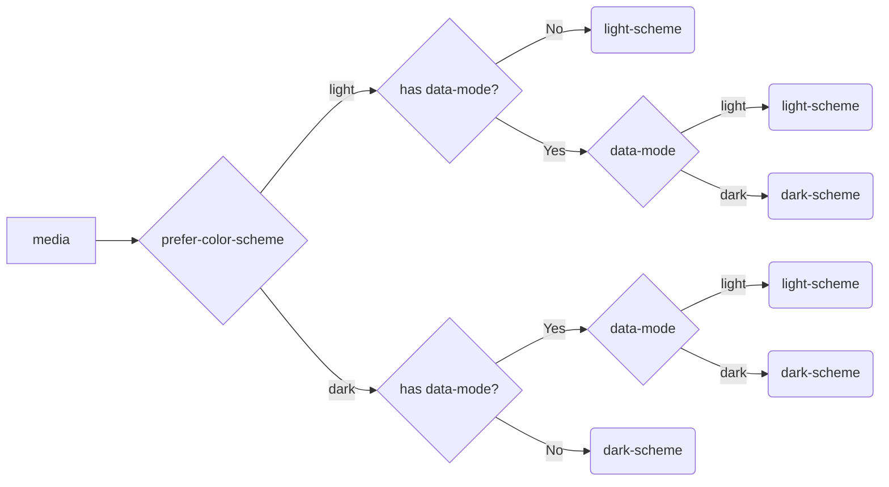

## 前言

本文旨在记录将waline评论系统部署至个人博客的过程中踩过的那些坑。另外，在文章开始之前先简单介绍一下此博客的本地环境，以及waline相关的基础信息：
- **博客环境**：基于 Github Pages 和 Jekyll 搭建， 使用 **[Chirpy](https://github.com/cotes2020/jekyll-theme-chirpy)** 主题。文中后续提到的操作都是在此主题模板的基础上进行的魔改。
- **waline相关**：后台使用 **[LeanCloud](https://leancloud.app/)** 国际版。

## 1. 部署过程

详细内容可以参照waline的 **[官方教程](https://waline.js.org/guide/get-started/)** 。简单概括如下：

- **LeanCloud** 账号注册及设置。此为管理waline评论系统所用的数据库，也即后台。
- 在 **Vercel** 上进行服务端部署。
- HTML引入。需要在自己的网站（在这里即为此博客）上导入waline样式。具体如下：
  - 在 [_includes/head.html](https://github.com/Zoooooone/Zoooooone.github.io/tree/main/_includes/head.html) 中添加如下语句：
    ```html
    <!-- Waline -->
    <link
        rel="stylesheet"
        href="https://unpkg.com/@waline/client@v2/dist/waline.css"
    />
    ```
  
  - 在 [_layouts/page.html](https://github.com/Zoooooone/Zoooooone.github.io/blob/main/_layouts/page.html) 中添加如下语句：
    ```html
    <!-- waline -->
    
    <style>
        #waline-container {
        margin-top: 0%;
        margin-bottom: 10%;
        }
        #waline {
        width: 100%;
        height: 100%;
        }
    </style>
    
    <div class="col-12 col-lg-11 col-xl-9 px-3 pe-xl-4 mt-0">
        <div id="waline-container">
            <div id="waline">
                <script type="module">
                import { init } from 'https://unpkg.com/@waline/client@v2/dist/waline.mjs';

                init({
                    el: '#waline',
                    serverURL: 'https://your-domain.vercel.app',
                    comment: true,
                });
                </script>
            </div>
        </div>
    </div>
    
    ```
    **注：** 须将该部分代码添加至 **tail** 之后，以对应博客文章界面的布局。<br> 

    <div id="visit"></div>

    在初始化waline的时候，需要传入`serverURL`这个参数，这个链接便是上一步于Vercel上进行服务端部署后得到的地址。示意如下：
    
    <div>  </div>
    
    此时点击右上角的 **Visit** 后进入评论测试页面：

    <div>  </div>

    该页面对应的地址便是`serverURL`所需的值。

## 2. 评论通知开启

### 官方文档

waline评论系统是支持通知功能的，也就是说当有人评论了博客文章后，博主便可以通过先前设置好的渠道接收到相关的通知。waline本身支持许多渠道的通知方式，包括但不限于**QQ**，**微信**，**邮箱**等。本人最初尝试了微信通知，但奈何技术水平或者理解能力有限，迟迟未能配置成功，也没太弄明白其中原理。在拖延了好一阵子后，想了想还是试试看邮箱通知能不能行得通吧，遂又参考官网给出的 **[教程](https://waline.js.org/guide/features/notification.html)** 。

这里还是简单概括一下，想要设置邮箱通知的话只需要在先前于Vercel上的服务端部署中设置如下几种必需的环境变量即可：

- **`SMTP_SERVICE`**: SMTP 邮件发送服务提供商，具体参考 **[这里](https://github.com/nodemailer/nodemailer/blob/master/lib/well-known/services.json)** 。如果运营商不支持，则必须填写`SMTP_HOST`和`SMTP_PORT`。本人选择的是利用Gmail邮箱接受通知，关于Gmail的服务提供商信息如下：
    ```
    "Gmail": {
        "aliases": ["Google Mail"],
        "domains": ["gmail.com", "googlemail.com"],
        "host": "smtp.gmail.com",
        "port": 465,
        "secure": true
    }
    ```
    因此，**`SMTP_SERVICE`** 处只需填写 **Gmail** 即可。

- **`SMTP_USER`**: SMTP 邮件发送服务的用户名，一般为登录邮箱。
- **`SMTP_PASS`**: SMTP 邮件发送服务的密码，一般为邮箱登录密码，部分邮箱(例如 163)是单独的 SMTP 密码。
- **`SMTP_SECURE`**: 是否使用 SSL 连接 SMTP。
- **`SITE_NAME`**: 网站名称，用于在消息中显示。
- **`SITE_URL`**: 网站地址，用于在消息中显示。
- **`AUTHOR_EMAIL`**: 博主邮箱，用来接收新评论通知。如果是博主发布的评论则不进行提醒通知。

环境变量的设置方式如下：

1. 从Vercel的Dashboard中进入先前已部署好的评论系统，点击上边栏中最右侧的 **Settings** 。
    

2. 选中左侧边栏中的 **Environment Variables**，按要求添加所需的环境变量并保存。
    

3. 选中上边栏中的 **Deployments**，点击最晚的那一条部署完毕的信息右侧的`...`，选择 **Redeploy**
    

4. 重新部署完毕后，参照 **[此处](#visit)** 点击 **Visit** ，随后进入测试界面发送一条评论，以确认邮箱是否会收到通知邮件。

### Gmail无法收到通知的解决方案

从教程来看这个设置并不困难，只要按部就班地完成似乎就没有什么问题了。然而事与愿违，本人按照流程正确地设置完后邮箱仍旧无法收到通知邮件。这就让人感到困惑了，到底是哪里出了问题？于是便google了一下想找找看有没有和我拥有相似遭遇并成功将问题解决了的人。

经过一番艰苦的查找后，我终于找到了救星，这还得感谢[使用Waline给Hexo静态博客添加评论系统](https://www.eula.club/blogs/%E4%BD%BF%E7%94%A8Waline%E7%BB%99Hexo%E9%9D%99%E6%80%81%E5%8D%9A%E5%AE%A2%E6%B7%BB%E5%8A%A0%E8%AF%84%E8%AE%BA%E7%B3%BB%E7%BB%9F.html)这篇博文的作者大大。问题的原因在于我使用的是**Gmail邮箱**接收通知，他提到如果是采用Gmail接收通知的话，需要先对Gmail进行**开启IMAP**和**单独应用密码**设置，然后用**单独应用密码**登录，而在默认的设置中这两项是不被启用的。

既然有了解决方案，接下来的任务就是完成这部分的设置，由于本人chrome浏览器的默认语言设置为日语，所以后续流程都会贴出图片辅以说明：

- **开启IMAP**
    1. 进入Gmail邮箱，点击右上角设置（齿轮状图标），选择 **すべての設定を表示**。
        <div>  </div>
    2. 选择上边栏中的 **メール転送と POP/IMAP**，然后 **ステータス** 选定 **IMAP を有効にする**，完成后将会如图所示。
        <div>  </div>

- **生成单独应用密码**
    1. 点击邮箱右上角头像，选择 **Google アカウントを管理** 。
        <div>  </div>
    2. 左侧边栏选中 **セキュリティ**， 然后 **Google にログインする方法** 中选中 **2段階認証プロセス** 。
        <div>  </div>
    3. 进入后滑动到页面最底端，选择 **アプリ パスワード** 。
        <div>  </div>
    4. App name处选择自己偏好的名称即可，填好名称后点击 **作成** ，便会自动生成一个16位的单独应用密码，我们只需将这个密码设置为服务端部署环境变量中的 **`SMTP_PASS`** 的值即可。
        <div>  </div>

完成以上设置后测试邮件通知功能，顺利完成！

## 3. 评论区样式

### 深色主题自动切换

依照waline官方给出的 **[教程](https://waline.js.org/guide/features/style.html#%E6%9A%97%E9%BB%91%E6%A8%A1%E5%BC%8F%E6%94%AF%E6%8C%81)**，waline评论区可以应用深色主题以达到与博客主题颜色相匹配（waline评论区默认为浅色主题，无法随着博客切换至深色主题而自动切换）。具体设置时根据不同的博客环境有如下两种情况：

- 使用 `@media` 选择器通过 `prefers-color-scheme` 来根据设备颜色模式状态自动切换
- 通过修改 dom 根元素 (`html` 或 `body`) 的属性与 `class` 来动态应用或取消深色主题的颜色样式

针对符合第一种情况的博客，只需要在
```javascript
import { init } from 'https://unpkg.com/@waline/client@v2/dist/waline.mjs';

init({
    el: '#waline',
    serverURL: 'https://your-domain.vercel.app',
    comment: true,
});
```

这部分waline的初始化代码中添加`dark`参数，然后将其值设定为`'auto'`即可。
```javascript
dark: 'auto'
```

对于此博客来说这个方法并不奏效，遂参考第二种情况。第二种情况需要我们找到控制博客主题颜色的那部分代码。经过一番查找后，发现其位于 [_sass/addon/commons.scss](https://github.com/Zoooooone/Zoooooone.github.io/blob/main/_sass/addon/commons.scss) 中:
```scss
html {
@media (prefers-color-scheme: light) {
    &:not([data-mode]),
    &[data-mode='light'] {
    @include light-scheme;
    }

    &[data-mode='dark'] {
    @include dark-scheme;
    }
}

@media (prefers-color-scheme: dark) {
    &:not([data-mode]),
    &[data-mode='dark'] {
    @include dark-scheme;
    }

    &[data-mode='light'] {
    @include light-scheme;
    }
}

font-size: 16px;
}
```

ps：阅读了这一段代码后个人感觉该博客似乎还是对应第一种情况的，但不知为何按照教程设置后并不管用。也有可能是本人对于这一部分的知识不甚了解，因而得出了错误的结论。如果有熟悉此部分原理的朋友还请指出，本人感激不尽。

回到代码，这一部分关于博客主题颜色切换的逻辑总结如下：

- 若当前用户设备的颜色偏好设置为**浅色**，也即`prefer-color-scheme`的值为`light`时：
  - 若`<html>`元素没有`data-mode`属性，或其`data-mode`属性为`light`时，调用浅色主题
  - 若`<html>`元素的`data-mode`属性为`dark`，调用深色主题
  
- 若当前用户设备的颜色偏好设置为**深色**，也即`prefer-color-scheme`的值为`dark`时：
  - 若`<html>`元素没有`data-mode`属性，或其`data-mode`属性为`dark`时，调用深色主题
  - 若`<html>`元素的`data-mode`属性为`light`，调用浅色主题

更直观些，用流程图来表示其主题匹配逻辑如下：



<br> waline官网针对第二种情况也给出了一些案例，大致如下：

<div style="text-align: center"> 
     
</div>

根据官网给出的提示，我将waline初始化的部分修改如下：
```javascript
dark: "html[data-mode=dark]"
```

### 问题分析

本以为应该大功告成了，但是测试后发现一切并不是那么简单。在又经过了无数次试错后，我终于大致弄明白了这是怎么一回事。首先这里的`prefer-color-scheme`我起初以为对应的是人为设置的主题，也就是浏览者在博客页面左下角选择的当前主题。但经过了多次实验后我发现它其实是根据**设备的系统时间**决定的，与浏览者手动选择的主题无关。

依据来源于以下实验（实验时间为晚上7点，默认颜色偏好为`dark`）：

| waline初始化设置 | 浏览者的手动选择 | 评论区呈现出的主题 |
| --- | --- | --- |
| `"html[data-mode=dark]"` | <span style="color: orange"> dark </span> | <span style="color: orange"> <b> dark </b> </span> |
| `"html[data-mode=dark]"` | <span style="color: orange"> light </span> | <span style="color: orange"> light </span> |
| `"html[data-mode=light]"` | <span style="color: royalblue"> dark </span> | <span style="color: royalblue"> light </span> |
| `"html[data-mode=light]"` | <span style="color: royalblue"> light </span> | <span style="color: royalblue"> light </span> |
| `"html:not([data-mode])"` | <span style="color: salmon"> dark </span> | <span style="color: salmon"> light </span> |
| `"html:not([data-mode])"` | <span style="color: salmon"> light </span> | <span style="color: salmon"> <b> dark </b> </span> |

根据实验结果可以总结出以下两个结论：

1. 从上至下第一部分颜色区块中waline的设置为：**只有当评论区的 `data-mode` 属性为 `dark` 时**，评论区才会更换为深色主题。而根据其结果可以得出：`prefer-color-scheme=dark` + 手动选择`dark` $\rightarrow$ `data-mode=dark`
2. 从上至下第三部分颜色区块中waline的设置为：**只有当评论区不拥有 `data-mode` 属性时**，评论区才会更换为深色主题。而根据其结果可以得出：`prefer-color-scheme=dark` + 手动选择`light` $\rightarrow$ `not([data-mode])`

由此结果可以合理猜测：
- 当根据系统时间决定的 `prefer-color-scheme` 与手动选择的主题 **匹配** 时，`data-mode`属性为指定的对应主题。
- 当根据系统时间决定的 `prefer-color-scheme` 与手动选择的主题 **不匹配** 时，则元素不具有`data-mode`属性。

### 解决方案

那么想要实现评论区主题的自动切换就需要写一套比较复杂的逻辑，而考虑到本人对于前端技术的理解极其有限，所以最终采取了一套更为粗暴的解决方案，即**直接在博客设定的css样式中定义不同主题下waline评论区的样式**。而关于waline的自定义样式，官网也给出了详细的说明（参考 **[此处](https://waline.js.org/reference/client/style.html)**）。

最终的实现方式：
- **浅色主题**，在 [_sass/colors/light-typography.scss](https://github.com/Zoooooone/Zoooooone.github.io/blob/main/_sass/colors/light-typography.scss) 中添加：
    ```scss
    /* waline */
    --waline-white: #fff;
    --waline-light-grey: #999;
    --waline-dark-grey: #666;
    --waline-color: #444;
    --waline-bgcolor: #f0f3f6;
    --waline-bgcolor-light: #f8f8f8;
    --waline-bgcolor-hover: #f0f0f0;
    --waline-border-color: #ddd;
    --waline-disable-bgcolor: #f8f8f8;
    --waline-disable-color: #000;
    --waline-bq-color: #f0f0f0;
    --waline-info-bgcolor: #f8f8f8;
    --waline-info-color: #999;
    --waline-theme-color: #80a4dc;
    --waline-active-color: #5b7ed5;
    --waline-code-bgcolor: #434d62;
    ```

- **深色主题**，在 [_sass/colors/dark-typography.scss](https://github.com/Zoooooone/Zoooooone.github.io/blob/main/_sass/colors/dark-typography.scss) 中添加：
    ```scss
    /* waline */
    --waline-white: #000;
    --waline-light-grey: #666;
    --waline-dark-grey: #999;
    --waline-color: #888;
    --waline-bgcolor: rgb(25 25 32);
    --waline-bgcolor-light: rgb(30 31 38);
    --waline-bgcolor-hover: #444;
    --waline-border-color: #333;
    --waline-disable-bgcolor: #444;
    --waline-disable-color: #272727;
    --waline-bq-color: #272727;
    --waline-info-bgcolor: #272727;
    --waline-info-color: #666;
    --waline-theme-color: #4a84d9;
    --waline-active-color: #6faeff;
    --waline-code-bgcolor: #282c34;
    ```

## 4. 浏览量统计与显示

### 官方文档

waline提供了两种浏览量统计方式（**[官方文档](https://waline.js.org/guide/features/pageview.html)**）：

- **与waline评论系统一起使用**，在waline初始化时将参数`pageview`设为`true`。
    ```javascript
    import { init } from 'https://unpkg.com/@waline/client@v2/dist/waline.mjs';

    init({
        el: '#waline',
        serverURL: 'https://your-domain.vercel.app',
        comment: true,
        pageview: true,  // enable pageview count
    });
    ```
    此方法的缺点是博客界面每次被刷新都会被强制统计浏览量，而当博客更新内容处于本地调试阶段的时候显然是不希望这种事情发生的。
    <br>

- **与waline评论区分离**，作为一个单独的模块使用
    waline也支持浏览量统计作为一个单独的功能模块被调用，方法如下：
    ```html
    <script type="module">
    import { pageviewCount } from 'https://unpkg.com/@waline/client/dist/pageview.mjs';

    pageviewCount({
        serverURL: '<YOUR_SERVER_URL>',
        path: window.location.pathname,
    });
    </script>
    ```

### 具体实现方式

**需求**：希望博客文章的发布日期右侧能够显示此文章当前的总浏览量，并且浏览量**在本地调试的过程中不被统计**。

首先，因为希望浏览量能够在发布日期右侧被显示，所以需要定位到管理发布日期显示的那一部分代码。对于此博客来说，其位于 [_layouts/post.html](https://github.com/Zoooooone/Zoooooone.github.io/blob/main/_layouts/post.html) 中：


```html
<!-- published date -->
<span>
    {{ site.data.locales[lang].post.posted }}
    
</span>

<!-- lastmod date -->

<span>
    {{ site.data.locales[lang].post.updated }}
    
</span>

```


在这段代码下方添加：

```html
<!-- pageview count -->
<style>
    .waline-pageview-count {
    font-family: var(--bs-font-sans-serif);
    font-size: 0.8rem;
    color: rgb(137, 152, 166);
    }
</style>    

&ensp; PageView <span class="waline-pageview-count"></span>

<script type="module">
    import { pageviewCount } from 'https://unpkg.com/@waline/client/dist/pageview.mjs';

    pageviewCount({
        serverURL: '<YOUR_SERVER_URL>',
        path: window.location.pathname,
    });
</script>
```

**注**： `servelURL`对应waline初始化时填写的地址。

目前为止是按照官方文档提供的方法进行的设置，但其无法满足 **在本地调试的过程中不被统计** 这个需求。因此需要在引入`pageview`模块时额外添加一个条件，用于判断当前的运行环境，利用Jekyll在本地生成调试用的网页时对应的地址是`127.0.0.1`，所以可以将引入模块部分的代码修改如下：

```javascript
if (window.location.hostname !== "localhost" && window.location.hostname !== "127.0.0.1") {
  import('https://unpkg.com/@waline/client@3.0.0-alpha.7/dist/pageview.js')
    .then(({ pageviewCount }) => {
      pageviewCount({
        serverURL: 'https://waline-beige-eight.vercel.app/',
        path: window.location.pathname,
        update: true,
      });
    })
    .catch(error => {
      console.error("Error loading pageviewCount:", error);
    });
} else {
  console.log("In local environment, pageview count is not updated.");
}
```

这里有几个需要注意的点：

- 官方给出的导入模块方式是采用**静态导入**，使用的是`import`语句，其不能位于代码块中。想要实现在条件判断语句中执行导入操作的话则应该更换为**动态导入**，使用`import()`函数。( **[参考链接](https://tsejx.github.io/javascript-guidebook/core-modules/modularization/dynamic-import/)** )

- 单独导入浏览量统计模块时，无需在waline初始化时设置`pageview`参数为`true`

- 当前时间点（2023.12.18）下，官方文档中给出的`pageview`模块的版本号似乎有误，无法正确导入。根据模块路径 `https://unpkg.com/browse/@waline/client/` 查找到 **[最新版本文件](https://unpkg.com/browse/@waline/client@3.0.0-alpha.7/)** ，在`package.json`中搜索到这样一段代码：
    ```json
    "./pageview": {
      "types": "./dist/pageview.d.ts",
      "import": "./dist/pageview.js",
      "default": "./dist/pageview.umd.js"
    }
    ```
    所以导入时的路径应该 **将`/dist/pageview.mjs`修改成`/dist/pageview.js`**。

### 测试

> **例子**
```html
当前文章浏览量: <span class="waline-pageview-count"></span>
```
> 当前文章浏览量: <span class="waline-pageview-count"></span>
{: .prompt-info }

## 参考链接

- [https://waline.js.org/guide/get-started/](https://waline.js.org/guide/get-started/)
- [https://waline.js.org/guide/features/notification.html](https://waline.js.org/guide/features/notification.html)
- [使用Waline给Hexo静态博客添加评论系统](https://www.eula.club/blogs/%E4%BD%BF%E7%94%A8Waline%E7%BB%99Hexo%E9%9D%99%E6%80%81%E5%8D%9A%E5%AE%A2%E6%B7%BB%E5%8A%A0%E8%AF%84%E8%AE%BA%E7%B3%BB%E7%BB%9F.html)
- [暗黑模式支持](https://waline.js.org/guide/features/style.html#%E6%9A%97%E9%BB%91%E6%A8%A1%E5%BC%8F%E6%94%AF%E6%8C%81)
- [https://waline.js.org/reference/client/style.html](https://waline.js.org/reference/client/style.html)
- [https://tsejx.github.io/javascript-guidebook/core-modules/modularization/dynamic-import/](https://tsejx.github.io/javascript-guidebook/core-modules/modularization/dynamic-import/)
