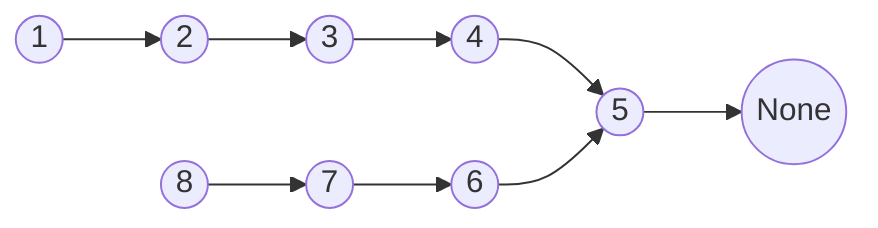

## 题目概述

[Leetcode 143](https://leetcode.com/problems/reorder-list/description/)

You are given the head of a singly linked-list. The list can be represented as:

$$
L_0 \rightarrow L_1 \rightarrow \cdots \rightarrow L_{n - 1} \rightarrow L_n
$$

*Reorder the list to be on the following form:*

$$
L_0 \rightarrow L_n \rightarrow L_1 \rightarrow L_{n - 1} \rightarrow L_{2} \rightarrow L_{n - 2} \rightarrow \cdots
$$

You may not modify the values in the list's nodes. Only nodes themselves may be changed.

<div style="text-align: center">

</div>

<div style="text-align: center">

</div>

**Constraints:**

- The number of nodes in the list is in the range `[1, 5 * 10 ^ 4]`.
- `1 <= Node.val <= 1000`
- Do not return anything, modify head in-place instead.

## 思路 & 代码实现

对于这个问题，一种简单的解法是遍历整个链表并存储每一个节点的值，随后利用双指针按照题目中指定的顺序建立一个新的链表。但这个做法并不满足 **原地（in-place）** 修改的要求，故而舍弃。

为了满足对原链表进行原地修改的要求，可行的操作是改变原链表中每个节点的指向。我们可以将重排后的链表进行如下拆分：

$$
L_0 \rightarrow \textcolor{red}{L_n} \rightarrow L_1 \rightarrow \textcolor{red}{L_{n - 1}} \rightarrow L_{2} \rightarrow \textcolor{red}{L_{n - 2}} \rightarrow \cdots
$$

可以得到如下两个链表：

$$
\begin{aligned}
    & L_0 \rightarrow L_1 \rightarrow L_2 \rightarrow \cdots \\[3mm]
    & L_n \rightarrow L_{n - 1} \rightarrow L_{n - 2} \rightarrow \cdots
\end{aligned}
$$

它们是以原链表中点为界，前半段保持节点指向不变，而后半段节点间指向翻转的两个链表。将这两个链表按节点依次合并便可以得到题目所要求的重排后的结果。由此，该问题便可以分解成三个子问题：

- **定位至原链表的中间节点** (对应 **[Leetcode 876](https://leetcode.com/problems/middle-of-the-linked-list/description/)**)
- **将原链表的后半段翻转** (对应 **[Leetcode 206](https://leetcode.com/problems/reverse-linked-list/description/)** )
- **将原链表前半段与翻转后的后半段中的节点依次合并** (对应 **[Leetcode 21](https://leetcode.com/problems/merge-two-sorted-lists/description/)**)

### 定位至链表中间节点

使用一快一慢的双指针。在一次迭代中，慢指针移动至当前节点的下个节点，快指针则移动至当前节点的下下个节点。也即快指针在链表中的行进速度是慢指针的两倍，这样当快指针访问至链表末尾时，慢指针正好走过一半的路程，此时其所停留的节点便是链表的中间节点。代码实现如下：

```python
slow, fast = head, head
# 迭代结束后, slow所停留的位置便是链表的中间节点。
while fast and fast.next:
    slow = slow.next
    fast = fast.next.next
```

### 翻转后半段链表

依旧使用双指针，指针`curr`指向当前节点，指针`prev`指向上一个节点。翻转链表其实就是依次翻转每两个连续节点间的指向，具体可以总结为如下几步：

1. 使用一个临时指针`temp`存储当前节点的下一个节点。因为**翻转节点间的指向后原本的下一个节点会丢失**，所以要事先存储。
2. 将当前指针`curr`所指的节点指向`prev`指针所指的节点，也即将当前节点的下一个节点更新为上一个节点。
3. 将`prev`指针移动至`curr`指针所指的位置。
4. 将`curr`指针移动至`temp`指针所指的位置。

如此完成一次迭代，**该迭代在`curr`指针所指为空时结束**。代码实现如下：

```python
curr, prev = head, None
# 迭代结束后, prev所停留的位置便是翻转后的链表表头
while curr:
    temp = curr.next
    curr.next = prev
    prev = curr
    curr = temp
```

此外，在python中还可以使用更加简洁的代码来实现这一操作：

```python
curr, prev = head, None
while curr:
    curr.next, prev, curr = prev, curr, curr.next
```

### 合并链表

为了便于后续的理解，这里举一个具体的例子。假设原链表如下：


第一步定位中间节点后，`slow`所指的应当是值为5的节点。接着将这个节点之后的链表翻转，得到的结果如下：



此时`prev`指向值为8的节点。合并前半段与后半段链表时依旧使用双指针，分别指向前半段链表与后半段链表的表头，这里将双指针依次命名为`first`，`second`：

```python
first, second = head, prev
```

接下来进入迭代，完成对链表的合并。每一次迭代过程中进行如下操作：

- 使用一个临时指针`temp`存储`first`所指节点的下一个节点，因为后续操作中 **`first`所指的节点要更新为`second`所指的节点，原本的下一个节点会丢失。**
- 将`first`的下一个节点更新为`second`所指的节点。
- 将`first`指针移动至`temp`所指的位置。
- 使用临时指针`temp`存储`second`所指节点的下一个节点，原理与第一步操作相同。
- 将`second`的下一个节点更新为`first`所指的节点。
- 将`second`指针移动至`temp`所指的位置。

**迭代在`second`所指的下一个节点为空时结束**。代码实现如下：

```python
while second:
    temp = first.next
    first.next = second
    first = temp
    temp = second.next
    second.next = first
    second = temp
```

此外，在python中上述代码可以简化为：

```python
while second.next:
    first.next, first = second, first.next
    second.next, second = first, second.next
```

## 总结

完整的题解如下所示：

```python
# Definition for singly-linked list.
# class ListNode:
#     def __init__(self, val=0, next=None):
#         self.val = val
#         self.next = next
class Solution:
    def reorderList(self, head: Optional[ListNode]) -> None:
        """
        Do not return anything, modify head in-place instead.
        """
        # 定位至链表中间节点
        slow, fast = head, head
        while fast and fast.next:
            slow = slow.next
            fast = fast.next.next

        # 翻转后半段链表
        curr, prev = slow, None
        while curr:
            curr.next, prev, curr = prev, curr, curr.next

        # 合并链表
        first, second = head, prev
        while second.next:
            first.next, first = second, first.next
            second.next, second = first, second.next
```

结果顺利通过。

**Time complexity:** <strong> $O(n)$ </strong>

**Space complexity:** <strong> $O(1)$ </strong>

<div style="text-align: center">

</div>

<br>

此题综合了三种链表中常见的操作，同时对双指针使用的熟练度提出了一定的要求，值得反复品味。