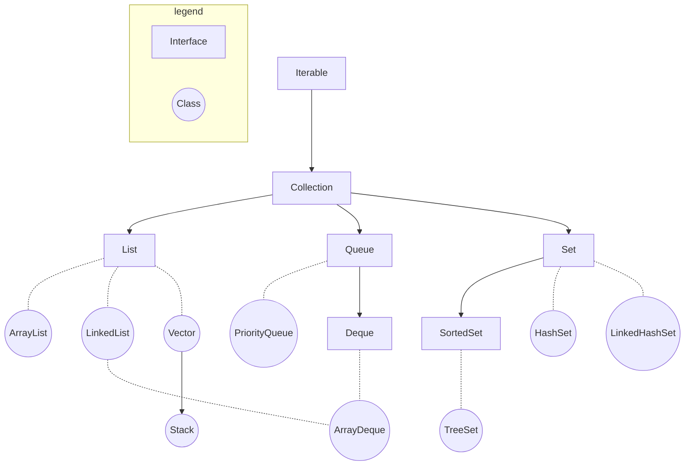
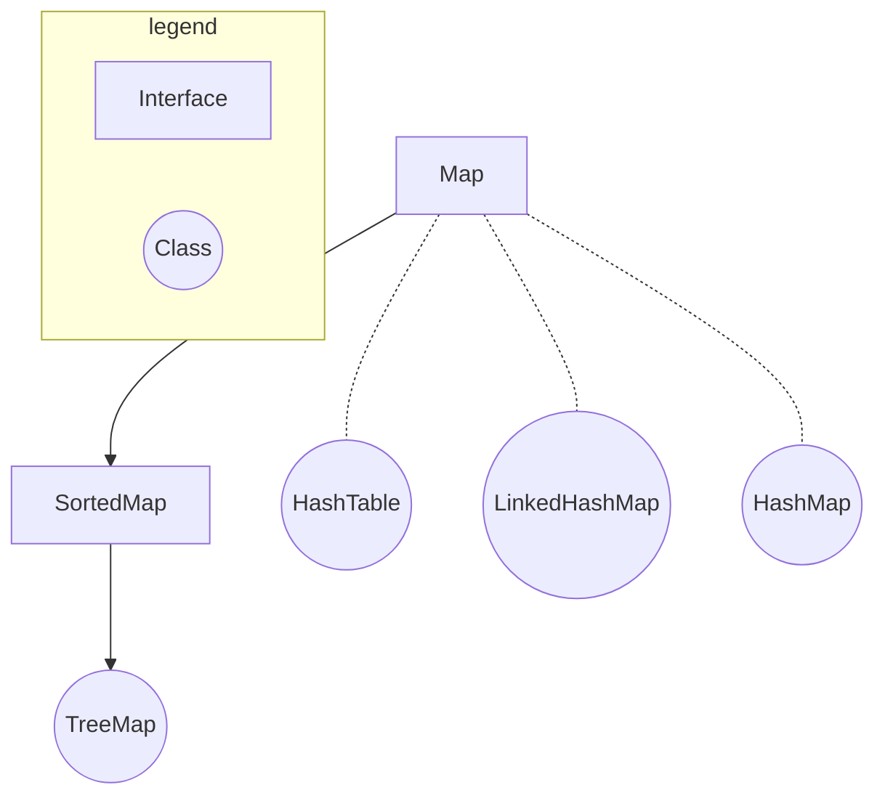

在后续文中所有的示例代码都以引入了`java.util`包为前提，即：
```java
import java.util.*;
```

# 整体框架
Java的集合框架分为两个体系：
- 基于**Collection接口**。Collection接口继承自Iterable接口，这说明其子类均可以实现**遍历操作**。

- 基于**Map接口**。子类均可以实现**键值对操作**，键不可重复。


## Collection框架


## Map框架


# Collection
Collection接口包含三个子接口：
- List，详述于[此文](https://zoooooone.github.io/posts/Java_List/)
- Queue，详述于[此文](https://zoooooone.github.io/posts/Java_Queue/)
- Set，详述于[此文](https://zoooooone.github.io/posts/Java_Set/)
  

# Map
Map接口的常用实现类有：
- HashMap
- LinkedHashMap
- TreeMap
- HashTable
  
关于Map接口的内容详述于[此文](https://zoooooone.github.io/posts/Java_Map/)


# 参考
- [https://forthe77.github.io/2019/03/28/collection-frame-diagram/](https://forthe77.github.io/2019/03/28/collection-frame-diagram/)
